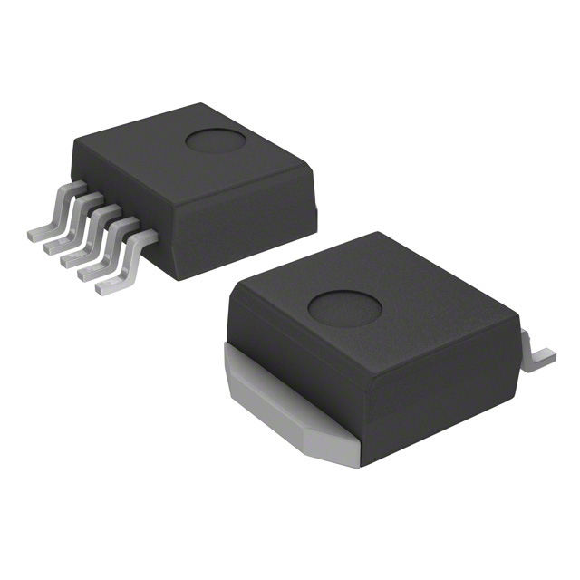
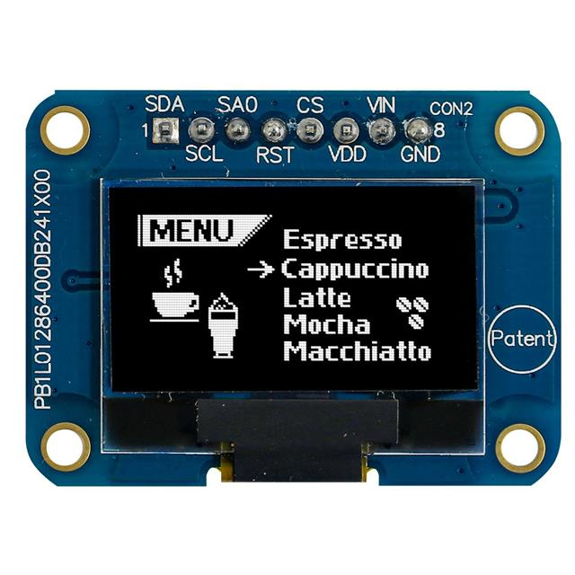
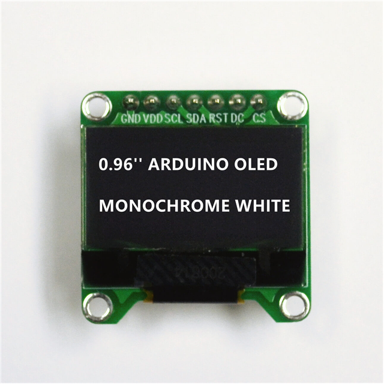
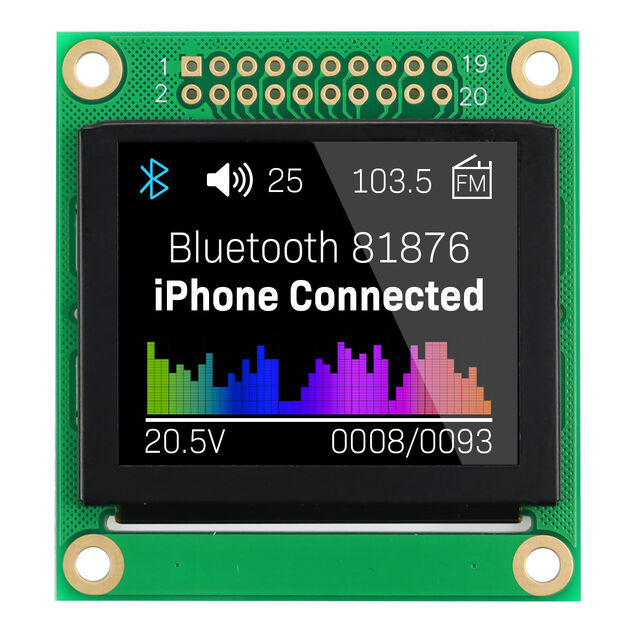
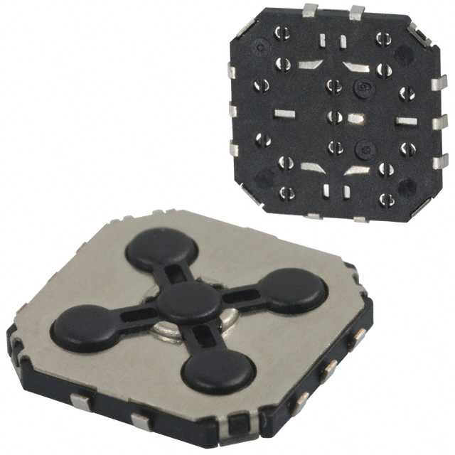
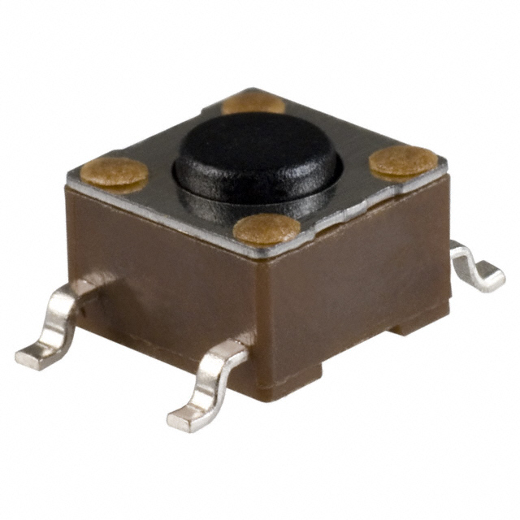
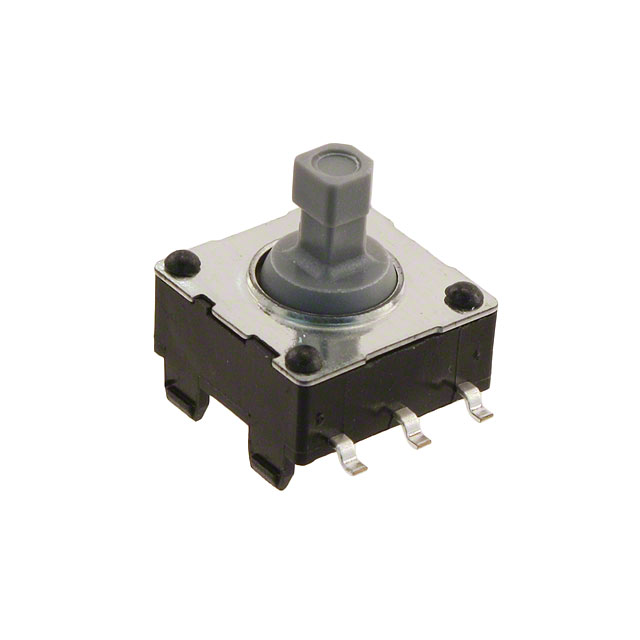

### 3.3 Switching Regulator
#### Option 1
| Solution | Pros | Cons |
|----------|------|------|
| $1.86 per  LM2575D2T-3.3G [Link](https://www.digikey.com/en/products/detail/onsemi/LM2575D2T-3-3G/1476686)|1. Experience with this component before 2. Fixed 3.Easier to surface mount by hand|1. Large Surface mount component| 

#### Option 2
| Solution | Pros | Cons |
|----------|------|------|
| $1.42 per  TPS62152RGTR [Link](https://www.digikey.com/en/products/detail/texas-instruments/TPS62152RGTR/2833441)|1. Takes less space on pcb 2. Cheapest component 3. Fixed|1. Harder to surface mount due to size and pin orientation. 2. More components on for recommended circuit.|

#### Option 3
| Solution | Pros | Cons |
|----------|------|------|
| $1.56 per  LM3671MF-3.3/NOPB [Link](https://www.digikey.com/en/products/detail/texas-instruments/LM3671MF-3-3-NOPB/1590062)|1. Smallest component 2. Surface mounting easier due to pin orientation.|1. Input voltage is only from 3-5.5v 2. Max current out is 500mA (Might not be a con depending on what other components I select)|

#### Selection

I am choosing option 1 or The LM2575D2T because of its ease to surface mount and also the fact that I have made circuits with this component before. I do not believe that its size will be a problem in the construction of my subsystem as of right now. Also it could easily connect to different power supplies based off the input voltage variance given in the data sheet. 

### OLED Screen
#### Option 1
| Solution | Pros | Cons |
|----------|------|------|
| $22.06 Ext Price  MDOB128064V2V-WI [Link](https://www.digikey.com/en/products/detail/midas-displays/MDOB128064V2V-WI/20841734)|1. Simple layout 2. Easy to wire 3. Initialization code in the datasheet|1. Can only buy in quantities of 2|

#### Option 2
| Solution | Pros | Cons |
|----------|------|------|
| $11.25 per  AOM12864A0-0.96WW-ANO [Link](https://www.digikey.com/en/products/detail/orient-display/AOM12864A0-0-96WW-ANO/22531926)|1. Simple data sheet 2. Cheaper price|1. Only monochrome white 2. SPI communication meaning more inputs|

#### Option 3
| Solution | Pros | Cons |
|----------|------|------|
| $25.91 per  NHD-1.8-160128UBC3 [Link](https://www.digikey.com/en/products/detail/newhaven-display-intl/NHD-1-8-160128UBC3/23334148)|1. Bigger screen 2. RGB customization|1. Extra layers of complexity due to its 20 connections. 2. Most expensive.|

#### Selection

I will be choosing option 1. The MDOB128064V2V-WI comes with two screens at the price of $22.06. Although the screens are small, it would be possible to have two screens instead of one for my block diagram. One screen could display a planet and the other would be able to display the planets info. Also, having two screen may make it easier to view sensor data and turn of GPIO pins. 

### Input Interface
#### Option 1
| Solution | Pros | Cons |
|----------|------|------|
| $2.18 per  JS1300AQ [Link](https://www.digikey.com/en/products/detail/e-switch/JS1300AQ/1556576)|1. Conveniently packaged 2. Simple data sheet|1. Price relative to other pushbuttons 2. Might press buttons on accident|

#### Option 2
| Solution | Pros | Cons |
|----------|------|------|
| $0.25 per  TL3301NF160QG-KR [Link](https://www.digikey.com/en/products/detail/e-switch/TL3301NF160QG-KR/271564)|1. Simple and effective 2. Very cheap|1. Need multiple for an interface to function|

#### Option 3
| Solution | Pros | Cons |
|----------|------|------|
| $3.71 per  JS5208 [Link](https://www.digikey.com/en/products/detail/e-switch/JS5208/1739634)|1. Compact Package 2. Simple surface mounting|1. Most expensive option|

#### Selection

The JS5208 joystick button seems to be a good option. Although it is expensive, there does not seem to be much room for error when surface mounting. It is a small package, making the human interface much easier to use.

### ESP32-S3-WROOM-1-N4

| ESP Info                                      | Answer |
| --------------------------------------------- | ------ | 
| Model                                         |ESP32-S3|
| Product Page URL                              |[Link](https://www.espressif.com/en/products/socs/esp32-s3)| 
| ESP32-S3-WROOM-1-N4 Datasheet URL             |[Datasheet](https://www.espressif.com/sites/default/files/documentation/esp32-s3-wroom-1_wroom-1u_datasheet_en.pdf)|
| ESP32 S3 Datasheet URL                        |[Datasheet](https://www.espressif.com/sites/default/files/documentation/esp32-s3_datasheet_en.pdf)|
| ESP32 S3 Technical Reference Manual URL       |[Technical Manual](https://www.espressif.com/sites/default/files/documentation/esp32-s3_technical_reference_manual_en.pdf)|
| Vendor link                                   |[DigiKey](https://www.digikey.com/en/products/detail/espressif-systems/ESP32-S3-WROOM-1-N4/16162639)|
| Code Examples                                 |[Github](https://github.com/LilyGO/ESP32-OLED0.96-ssd1306)|
| External Resources URL(s)                     |[Youtube](https://www.youtube.com/watch?v=VZDCkARFCPk&list=PLOkhax8xuWu2u3VHgXfjIoKpoQAHwBzvQ)|
| Unit cost                                     |$2.95   |
| Absolute Maximum Current for entire IC        |.5A     |
| Supply Voltage Range                          |3.0(min)/3.3(nominal)/3.6(max)|
| Maximum GPIO current   (per pin)           |40mA    |
| Supports External Interrupts?                 |Yes     |
| Required Programming Hardware, Cost, URL      |[Link](https://docs.espressif.com/projects/esp-idf/en/stable/esp32s3/get-started/index.html)|

#### Rational for ESP32

I choose the ESP32 because of the ability for any GPIO pin to work with I2C. I2C is crucial for my OLED screen, therefore this really mattered. I also like the interface of the ESP32 on VSCode. I feel much more confortable working with the ESP32 and with it being nearly $3, I can afford to mess up. 

### My Role

My Team is creating a project that simulates the equivalent gravity on certain planet in the solar system. My role is to create a HMI subsystem so that information about planets can be displayed. The HMI must also be able to toggle pins on and off and display sensor data. That stuff would be for my team and not the user. This information however would still be useful however. My role on my team is to also record notes and be good a documenting data when in team meetings. 

#### HMI Needs For ESP 32

| Module         | # Available | Needed | Pins chosen                    |
| -------------- | ----------- | ------ | ------------------------------ |
| UART           | 8           | 2      | IO17,I018                      |
| I2C            | 39          | 2      | IO7, IO8                       |
| GPIO           | 39          | 3      | IO4, IO5, IO6                  |
| USB Programmer | 4           | 2      | TXD0, RXD0                     |