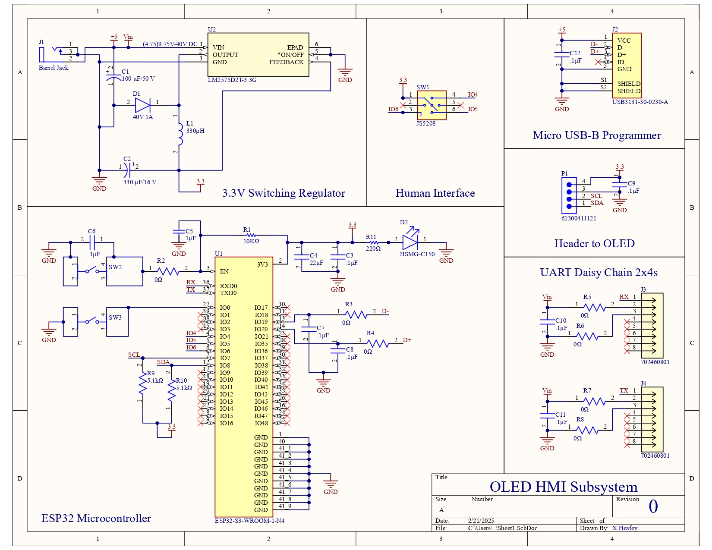

This schematic is my first revision for an OLED HMI subsystem. Design choices regarding the Microcontroller were made according to the [ESP 32 datasheet](https://www.espressif.com/sites/default/files/documentation/esp32-s3-wroom-1_wroom-1u_datasheet_en.pdf). On page 43, there is a section describing what basic peripherals should look like. This included the EN and Boot functions that the board provides. All parts at the time of making the schematic, are able to be bought off of Digikey. Links to the Packed Altium Project and PDF Schematics are below.  

[PDF](X.Heafey_HMI_Subsystem.pdf)  
[Zip](X.Heafey_HMI_Subsystem%20(2-21-2025%206-20-37%20PM).zip)